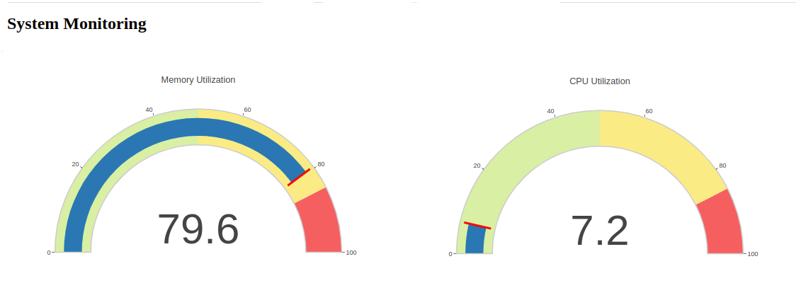

# kube-app-demo
This repo creates a Jenkins pipeline with GitOps to deploy code into a Kubernetes cluster.

## Steps

* 1\. Deploying the Flask application locally
* 2\. Integrate changes to registry
    * 2.1\. Dockerizing the Flask application
    * 2.2\. Pushing the Docker image to DockerHub/ECR using Jenkins pipeline
* 3\. Update image tag on kubernetes manifest file 
* 4\. Atomated deploying the app using Python | Jenkins | ArgoCD (GitOps)
    * 4.1\. Creating/Configuring an EKS cluster

## Application

